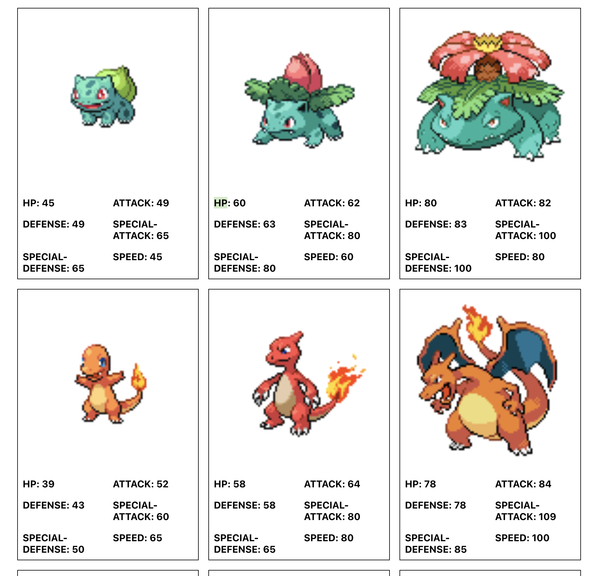

# Pokemon Interview Instructions
- All components can be found in the /src/components directory
- Update the Page component to retrieve pokemon data (url provided in the file)
- Render a Pokemon component for each node of data that was retrieved
- Update Pokemon component with styles to match the pokemon_end_product.png image
- Make any improvement updates to the Page / Pokemon components

What it should look like in the end -
